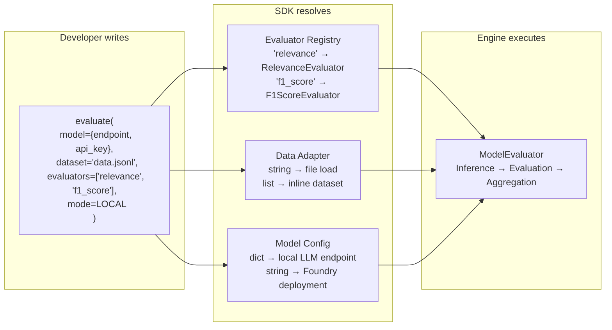
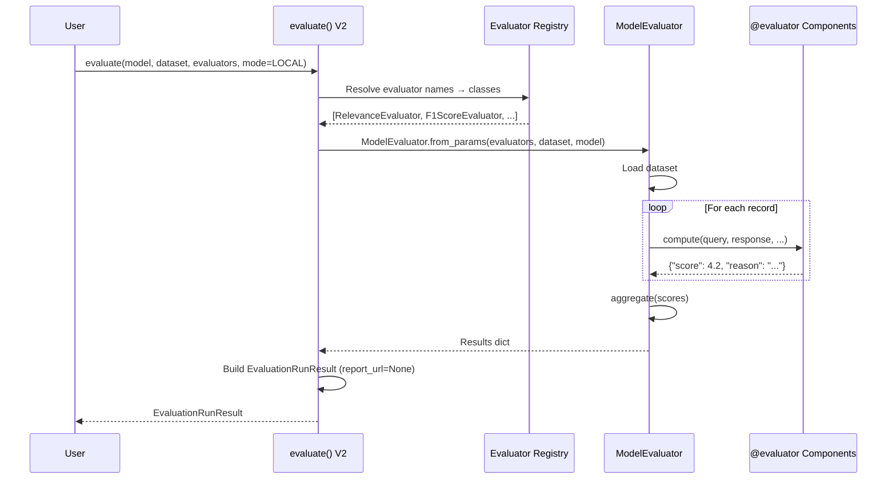
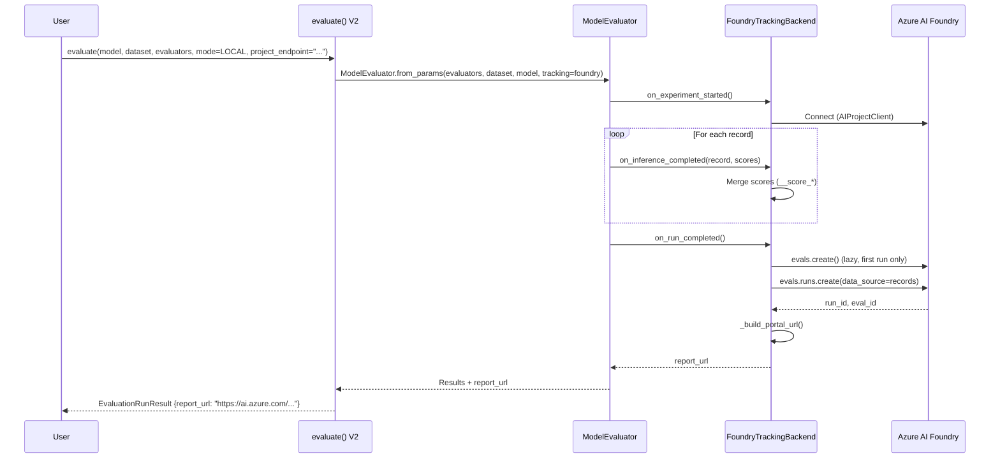
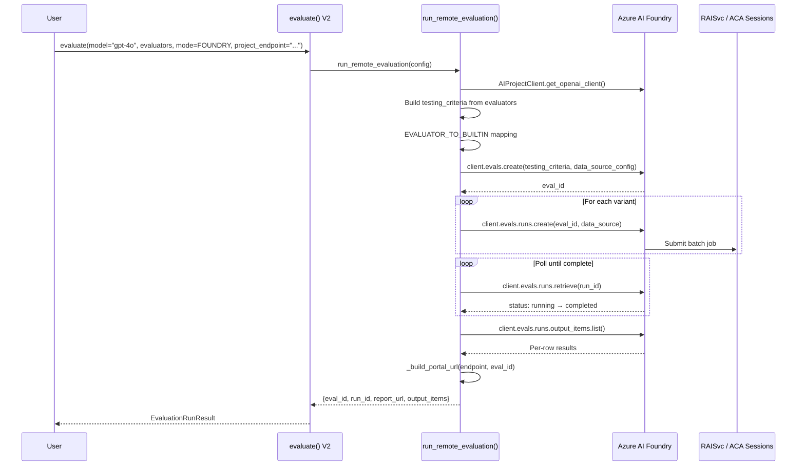
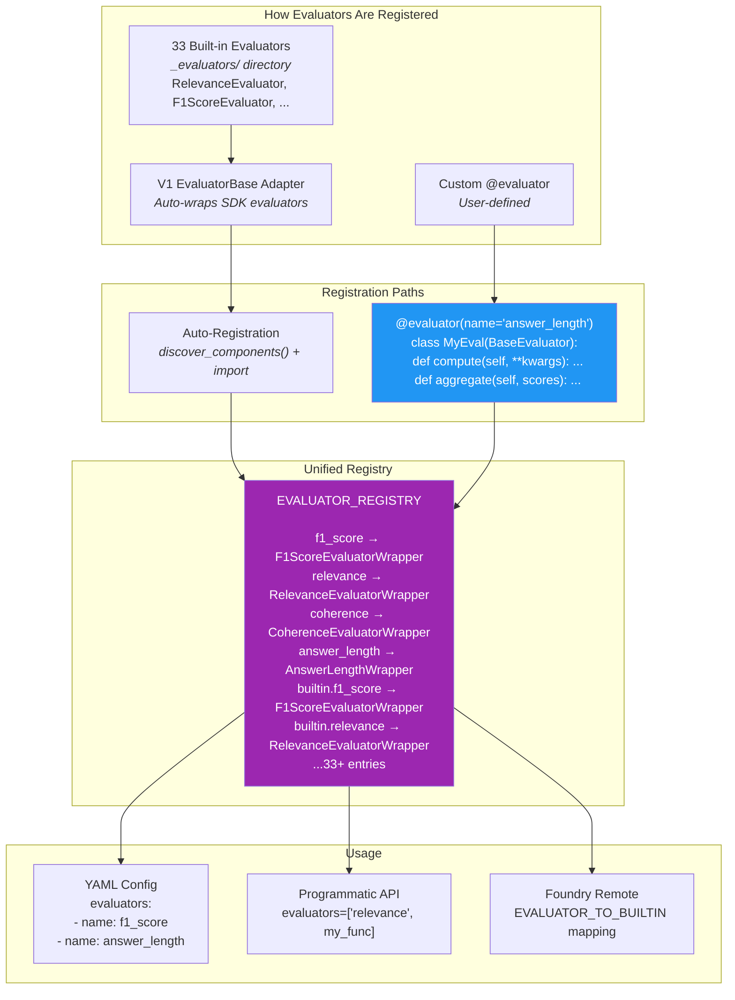
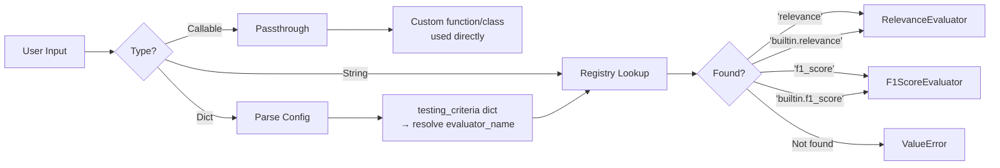
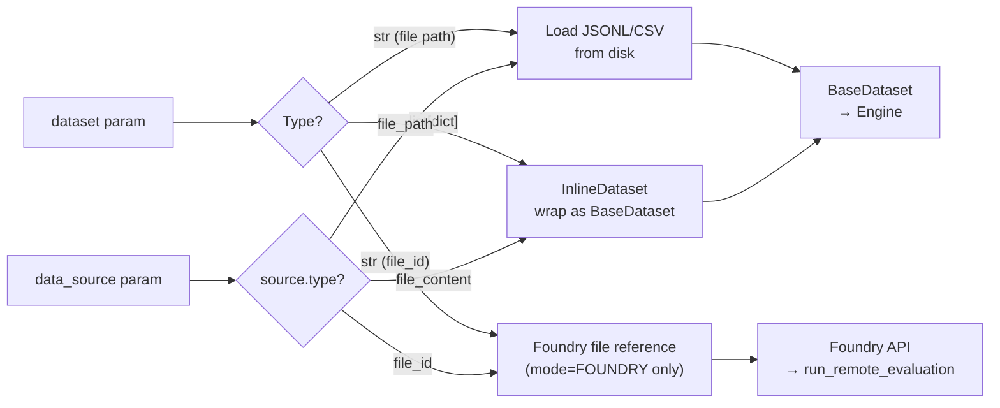

# SDK V2 + Evee Engine Integration Plan

> **Branch:** `dorlugasigal/feature/local-eval-v2-ev`  
> **SDK V2 Spec:** [PR #2000214](https://msdata.visualstudio.com/Vienna/_git/Observability-Specs/pullrequest/2000214)  
> **Human Annotations Spec:** [PR #2009453](https://msdata.visualstudio.com/Vienna/_git/Observability-Specs/pullrequest/2009453)

### Diagrams (open in draw.io)

| Diagram | File | Description |
|---------|------|-------------|
| 🏗️ Architecture Overview | [architecture-overview.drawio](./architecture-overview.drawio) | Full system architecture: API surface → normalization → execution → output |
| 📦 Component Inventory | [component-inventory.drawio](./component-inventory.drawio) | What stays ✅, what needs building 🔨, what needs wiring 🔌, what's deprecated 🔄 |
| 🔀 Phase Dependencies | [phase-dependencies.drawio](./phase-dependencies.drawio) | Implementation phases (1-5) with 16 todos and dependency arrows |
| ▶️ Execution Flow | [execution-flow.drawio](./execution-flow.drawio) | Request lifecycle: evaluate() → mode routing → local/foundry paths → EvaluationRunResult |

---

## 1. Executive Summary

The evee engine has been integrated into `azure-ai-evaluation` as `_engine/`. The Evaluation SDK 2.0 spec defines a unified `evaluate()` API with execution modes (LOCAL/FOUNDRY), Foundry result publishing, and a simplified developer experience. This plan reconciles what stays, what goes, and what must be built — with evee as the execution backbone complementing the SDK V2 design.

**Key principle:** Evee provides the local execution engine, extensibility model (`@evaluator`, `@target`, `@dataset`), CLI, and UI. SDK V2 provides the unified programmatic API surface and Foundry integration. They work together.

---

## 1.1 Meeting Context — Foundry Collaboration (March 2026)

The ISC team (Guy, Yuval) and Foundry team (Sam, Sebastian, Felisha, Ahmad) met to discuss integration of the EV (evee) evaluation framework into Foundry. Key outcomes:

### Strategic Decisions
- **EV merges into Foundry** — ISC is not a product group; integrating EV into Foundry enables public release and broader scaling
- **13 customers already using EV** with diverse use cases — strong internal adoption validates the framework
- **4 ISC engineers committed** to collaborate on integration, with management support
- **Foundry backend preferred** over Azure ML (deprecated trajectory) — align tracking/compute to Foundry

### Technical Alignment
- **EV treats models as black boxes** — supports LLMs, agents, CV models, any callable target
- **Metrics are wrappers** with custom compute + aggregation logic (maps to `@evaluator` pattern)
- **Multi-parameter evaluation** — users can sweep across temperature, deployment, etc. (variant expansion)
- **Local + remote execution** — local compute and Foundry compute already supported

### Feature Gaps Identified
- **Multi-conversation evaluation** (multi-agent, multi-turn) — not yet implemented, high priority
- **Trace-based evaluation** — new agent framework semantics (trace propagation) may enable this
- **Private preview coordination** — customer lists to be synced between ISC and Foundry teams

### Action Items from Meeting

#### Foundry Team
1. ✅ **Felisha & Ahmad**: Deep dive into EV, recommend integration approach (1 week)

#### ISC Team (Us)
2. 🔒 **Push code** once permissions are granted (branch: `dorlugasigal/feature/local-eval-v2-ev`)
3. 🔨 **Investigate multi-conversation evaluation** — multi-agent, multi-turn. Depends on agent framework trace propagation semantics.
4. 📋 **Share customer list** with Sebastian & Sam for private preview coordination
5. 🧑‍💻 **Support Felisha & Ahmad** deep dive — answer questions, provide access, demo capabilities
6. 🔍 **Explore AI Toolkit integration** — map evaluation integration points with [AI Toolkit for VS Code](https://learn.microsoft.com/en-us/visualstudio/ai/overview)
7. 🔍 **Explore OTel-based evaluation instrumentation** — align with [GenAI semantic conventions for evaluation results](https://github.com/open-telemetry/semantic-conventions/blob/main/docs/gen-ai/gen-ai-events.md#event-eventgen_aievaluationresult). Determine how evaluation scores/metrics could be emitted as OTel events (aligns with Foundry observability model: Azure Monitor / App Insights trace store).

---

## 2. Current State — Component Inventory

> 📊 *Editable diagram: [component-inventory.drawio](./component-inventory.drawio)*


### 2.1 What Stays ✅

| Component | Location | Lines | What It Does |
|-----------|----------|-------|-------------|
| **Engine core** | `_engine/evaluator.py` | 954 | `ModelEvaluator` orchestrates inference → eval → aggregation with tracking events |
| **`@evaluator` decorator** | `_engine/decorators.py` | 286 | Canonical extensibility: `@evaluator(name="...")` registers into `EVALUATOR_REGISTRY`. (`@metric` is backward-compat alias) |
| **Target system** | `_engine/evaluator.py` | — | 3 target types: `custom` (registry), `azure_ai_model` (OpenAI), `azure_ai_agent` (Foundry Responses API) |
| **CLI** | `cli.py` | 1,205 | Click-based: `run`, `list`, `config`, `init` with rich output |
| **UI** | `_engine/ui/` | — | React + Vite results viewer, standalone HTML output |
| **Tracking backends** | `_engine/tracking/` | 375+ | Abstract interface + NoOp + **FoundryTrackingBackend** (publishes via `openai_client.evals.runs.create()`) |
| **Foundry compute** | `_engine/foundry_compute.py` | 880 | eval creation, `EVALUATOR_TO_BUILTIN` mapping (18+ evaluators), variant expansion, run submission, polling, result collection, portal URL building |
| **Config system** | `_engine/config.py` | 205 | Pydantic v2 models, YAML with env var interpolation, backward-compat normalization |
| **Discovery** | `_engine/discovery.py` | 115 | AST-based auto-discovery of `@evaluator`/`@target`/`@dataset` decorated classes |
| **33 Built-in evaluators** | `_evaluators/` | — | Full evaluator library with base classes (AI-assisted, NLP, Safety, Agent) |
| **AOAI Graders** | `_aoai/` | — | 6 grader types |
| **Evaluator→Builtin mapping** | `foundry_compute.py` L18-42 | — | `EVALUATOR_TO_BUILTIN = {"f1_score": "builtin.f1_score", ...}` — 18+ entries |
| **NLP evaluator detection** | `foundry_compute.py` L48-55 | — | `NLP_EVALUATORS` set — evaluators needing no model deployment |

### 2.2 What Exists But Needs Refinement ⚠️

| Component | Location | Current State | What's Needed |
|-----------|----------|---------------|---------------|
| **V2 bridge** | `_eval_v2.py` (214 lines) | Takes V1-style params, creates temp YAML | Refactor for V2 spec shape |
| **Evaluator mapping** | `foundry_compute.py` lines 18-42 | `EVALUATOR_TO_BUILTIN` with 18+ entries | Unify with `EVALUATOR_REGISTRY` |
| **NLP detection** | `foundry_compute.py` lines 48-55 | `NLP_EVALUATORS` set | Integrate into unified registry |

### 2.3 What Gets Deprecated 🔄

| Component | Location | Reason |
|-----------|----------|--------|
| **V1 `evaluate()`** | `_evaluate/_evaluate.py` (3,525 lines) | Replaced by V2 unified API |
| **Legacy batch engine** | `_legacy/` | Already deprecated |

---

## 3. SDK V2 Design — API Surface

The spec proposes two API options. Both normalize to the same internal format.

### 3.1 Option 2: Simplified Developer-First API (Primary)



```python
# Minimal local evaluation (3 config lines)
from azure.ai.evaluation import evaluate

result = evaluate(
    model={"endpoint": "https://...", "api_key": "sk-...", "api_version": "2024-06-01"},
    dataset="./data/test_data.jsonl",
    evaluators=["relevance", "coherence", "f1_score"],
)

# With Foundry publishing
result = evaluate(
    model={"endpoint": "https://...", "api_key": "sk-...", "api_version": "2024-06-01"},
    dataset="./data/test_data.jsonl",
    evaluators=["relevance", "violence", "f1_score"],
    project_endpoint="https://myaccount.services.ai.azure.com/api/projects/myproject",
    name="nightly-eval",
)
print(result["report_url"])  # Foundry dashboard

# Cloud execution
result = evaluate(
    model="gpt-4o-mini",  # Foundry deployment name
    dataset="./data/test_data.jsonl",
    evaluators=["relevance", "coherence", "violence"],
    mode=EvaluationMode.FOUNDRY,
    project_endpoint="https://myaccount.services.ai.azure.com/api/projects/myproject",
)

# Custom evaluators mixed with builtins
result = evaluate(
    model={"endpoint": "https://...", "api_key": "sk-..."},
    dataset=[{"query": "What is AI?", "response": "AI is..."}],
    evaluators=["relevance", my_custom_func, MyEvaluatorClass()],
)
```

### 3.2 Option 1: Foundry-Aligned JSON Dict API (Alternative)

```python
result = evaluate(
    azure_ai_project="https://myaccount.services.ai.azure.com/api/projects/myproject",
    mode=EvaluationMode.LOCAL,
    testing_criteria=[
        {
            "type": "azure_ai_evaluator",
            "name": "relevance",
            "evaluator_name": "builtin.relevance",
            "data_mapping": {"query": "{{item.query}}", "response": "{{item.response}}"},
            "initialization_parameters": {"model_config": {"endpoint": "...", "api_key": "..."}},
        },
    ],
    data_source={"type": "jsonl", "source": {"type": "file_path", "path": "./data.jsonl"}},
)
```

---

## 4. Architecture — How It All Fits Together

### 4.1 High-Level Architecture

> 🏗️ *Editable diagram: [architecture-overview.drawio](./architecture-overview.drawio)*


### 4.2 Execution Modes — Sequence Diagrams

> ▶️ *Editable diagram: [execution-flow.drawio](./execution-flow.drawio)*


#### Local Mode (without Foundry)



#### Local Mode (with Foundry publishing)



#### Foundry Mode (cloud execution)



### 4.3 Evaluator Extensibility Model



---

## 5. Gap Analysis

### 5.1 What's Missing vs What Already Exists

> *See the [Component Inventory diagram](#2-current-state--component-inventory) above for a visual breakdown of what stays ✅, needs building 🔨, needs wiring 🔌, and is deprecated 🔄.*

### 5.2 New Gaps from Meeting

| Gap | Priority | Context |
|-----|----------|---------|
| **Multi-conversation evaluation** | High | Sam identified this as a missing feature. Multi-agent, multi-turn evaluation across sub-agents. Depends on agent framework trace propagation semantics. |
| **Trace-based evaluation** | Medium | Sebastian noted new agent framework semantics may enable this. Evaluate based on OTel traces rather than direct inference. |
| **Foundry backend alignment** | High | Move away from Azure ML backend (deprecated) → Foundry. Already partially done via `foundry_compute.py` and `FoundryTrackingBackend`. |
| **Private preview readiness** | Medium | Customer-facing preview for skill-based and MCP features. Need to coordinate customer lists between ISC and Foundry teams. |

---

## 6. Implementation Plan

### 6.1 Phase Dependency Graph

> 🔀 *Editable diagram: [phase-dependencies.drawio](./phase-dependencies.drawio)*


### 6.2 Phase Details

#### Phase 1: Foundation

**1.1 — Define SDK V2 Core Types**

Create `_types.py`:
```python
class EvaluationMode(str, Enum):
    LOCAL = "local"       # Evaluators run locally
    FOUNDRY = "foundry"   # Evaluators run in Foundry cloud

class EvaluationRunResult(TypedDict):
    evaluation_id: str
    run_id: str
    status: str                     # "completed" | "failed"
    metrics: Dict[str, float]       # Aggregated metrics
    rows: List[Dict[str, Any]]      # Per-row results
    report_url: Optional[str]       # Foundry dashboard URL
    studio_url: Optional[str]       # Foundry Studio URL
```

**1.2 — Consolidate Evaluator Name Registry**

Unify the two existing registries into one authoritative source:

| Source | Location | Current Entries |
|--------|----------|----------------|
| `EVALUATOR_REGISTRY` | `_engine/decorators.py` | Dynamic (populated via `@evaluator` + `discover_components()`) |
| `EVALUATOR_TO_BUILTIN` | `_engine/foundry_compute.py` | 18+ static mappings (`"relevance"` → `"builtin.relevance"`) |
| `NLP_EVALUATORS` | `_engine/foundry_compute.py` | 6 entries (evaluators needing no model) |

Target: Single registry supporting:
- Short names: `"relevance"` → `RelevanceEvaluator`
- Qualified names: `"builtin.relevance"` → same
- Category metadata: AI-assisted, NLP, Service-based
- POC demo pattern: config YAML references by name, `discover_components()` resolves

#### Phase 2: Engine Bridge

**2.1 — Programmatic ModelEvaluator Construction**

Current flow (brittle):
```
evaluate_v2(data, evaluators) → _build_config_from_args() → temp YAML file → ModelEvaluator(config_path=temp.yaml)
```

Target flow (clean):
```
evaluate(model, dataset, evaluators) → Config.from_params(...) → ModelEvaluator(config=config_obj)
```

**2.2 — V1 Evaluator → `@evaluator` Adapter**

Wrap all 33 `EvaluatorBase` subclasses for engine compatibility:
```python
# Auto-wrap RelevanceEvaluator as engine-compatible @evaluator
@evaluator(name="relevance")
class RelevanceEvaluatorWrapper(BaseEvaluator):
    def __init__(self, config, context):
        self._inner = RelevanceEvaluator(model_config=context.get_connection("default"))
    
    def compute(self, **kwargs):
        return self._inner(**kwargs)
    
    def aggregate(self, scores):
        return {k: sum(s[k] for s in scores) / len(scores) for k in scores[0]}
```

**2.3 — Inline Data Source**

Extend `BaseDataset` to support:
```python
# list of dicts → engine dataset
InlineDataset([{"query": "...", "response": "..."}])

# data_source dict → parsed dataset
DataSourceAdapter({"type": "jsonl", "source": {"type": "file_content", "content": [...]}})
```

#### Phase 3: SDK V2 `evaluate()` Implementation

**3.1 — Refactor `_eval_v2.py` → V2 Simplified API (Option 2)**

```python
def evaluate(
    *,
    model: Union[str, Dict[str, Any], None] = None,
    dataset: Union[str, List[Dict[str, Any]]],
    evaluators: List[Union[str, Callable]],
    mode: EvaluationMode = EvaluationMode.LOCAL,
    name: Optional[str] = None,
    project_endpoint: Optional[str] = None,
    output_path: Optional[str] = None,
    tags: Optional[Dict[str, str]] = None,
    **kwargs,
) -> EvaluationRunResult:
    if mode == EvaluationMode.LOCAL:
        return _execute_local(model, dataset, evaluators, project_endpoint, ...)
    elif mode == EvaluationMode.FOUNDRY:
        return _execute_foundry(model, dataset, evaluators, project_endpoint, ...)
```

**3.2 — Add Option 1 Support (Foundry-aligned)**

Accept `testing_criteria` + `data_source` as alternative params. Normalize to same internal format.

**3.3 — Wire Foundry Mode**

Connect to existing `run_remote_evaluation()` in `foundry_compute.py`:
```python
def _execute_foundry(model, dataset, evaluators, project_endpoint, ...):
    config_path = _build_config_for_remote(model, dataset, evaluators, project_endpoint)
    result = run_remote_evaluation(config_path, project_endpoint=project_endpoint)
    return EvaluationRunResult(
        evaluation_id=result["eval_id"],
        run_id=result["run_id"],
        report_url=result["report_url"], ...
    )
```

**3.4 — Wire Local Publishing**

Use existing `FoundryTrackingBackend` when `project_endpoint` is provided:
```python
def _execute_local(model, dataset, evaluators, project_endpoint, ...):
    tracking_config = None
    if project_endpoint:
        tracking_config = {"type": "foundry", "azure_ai_project": project_endpoint}
    
    evaluator = ModelEvaluator.from_params(
        evaluators=resolved_evaluators,
        dataset=dataset_obj,
        tracking_config=tracking_config,
    )
    result = evaluator.evaluate(dataset_obj)
```

#### Phase 4: Ship

**4.1 — Public API Exports** (`__init__.py`)
```python
from ._types import EvaluationMode, EvaluationRunResult
from ._eval_v2 import evaluate  # V2 replaces V1
from ._engine import evaluator, target, dataset  # Decorators
from ._engine import BaseEvaluator, BaseTarget, BaseDataset  # Base classes
```

**4.2 — CLI V2 Integration**
```bash
local-evals run --config evals.yaml --mode foundry --project-endpoint "https://..."
```

**4.3 — V1 Deprecation**
- Add `DeprecationWarning` to V1 `evaluate()` pointing to V2
- Keep working during transition

#### Phase 5: Quality

**5.1 — Port Tests from Evee Repo**

The evee repo at `/Users/dorlugasigal/Projects/evee` has 461 tests:

| Category | Files | Coverage |
|----------|-------|----------|
| Core (base_evaluator, base_target, base_dataset) | 7 | Decorator system, registries |
| Evaluation (model_evaluator variants) | 14 | Engine orchestration |
| Config | multiple | YAML parsing, env vars |
| Tracking | multiple | Backend abstraction |
| CLI | 24 | All commands |
| E2E | 3 + test project | Full pipeline |
| Integration | 5 | Foundry evaluators, workflows |

**5.2–5.3 — V2 API + E2E Tests**

**5.4 — Documentation**

---

## 7. Data Flows

### 7.1 Evaluator Name Resolution Flow



### 7.2 Data Source Resolution Flow



---

## 8. Open Questions

| # | Question | Recommendation | Meeting Context |
|---|----------|----------------|-----------------|
| 1 | Option 1 vs Option 2 vs Both? | **Both** — Option 2 as primary, Option 1 as alternative. Normalize internally. | — |
| 2 | V1 backward compat duration? | At least 2 major releases with `DeprecationWarning` | — |
| 3 | Human annotations spec (PR #2009453) — in scope? | **Not this milestone** — separate workstream | — |
| 4 | Decorator naming in public API? | Export `@evaluator` (canonical), keep `@metric` as deprecated alias | — |
| 5 | `evaluate()` v2 fully replaces v1 or coexists? | Coexist initially → full replacement after deprecation period | — |
| 6 | Multi-conversation evaluation? | **High priority gap** — Sam flagged this. Depends on agent framework trace propagation. | Meeting action item |
| 7 | Azure ML backend removal? | **Yes** — Sebastian recommended moving to Foundry. Azure ML on deprecation trajectory. | Meeting decision |
| 8 | Integration approach with Foundry? | Waiting for Felisha & Ahmad's technical deep dive (1 week) | Meeting action item |
| 9 | Private preview customer coordination? | Guy to share ISC customer list with Sebastian/Sam | Meeting action item |
