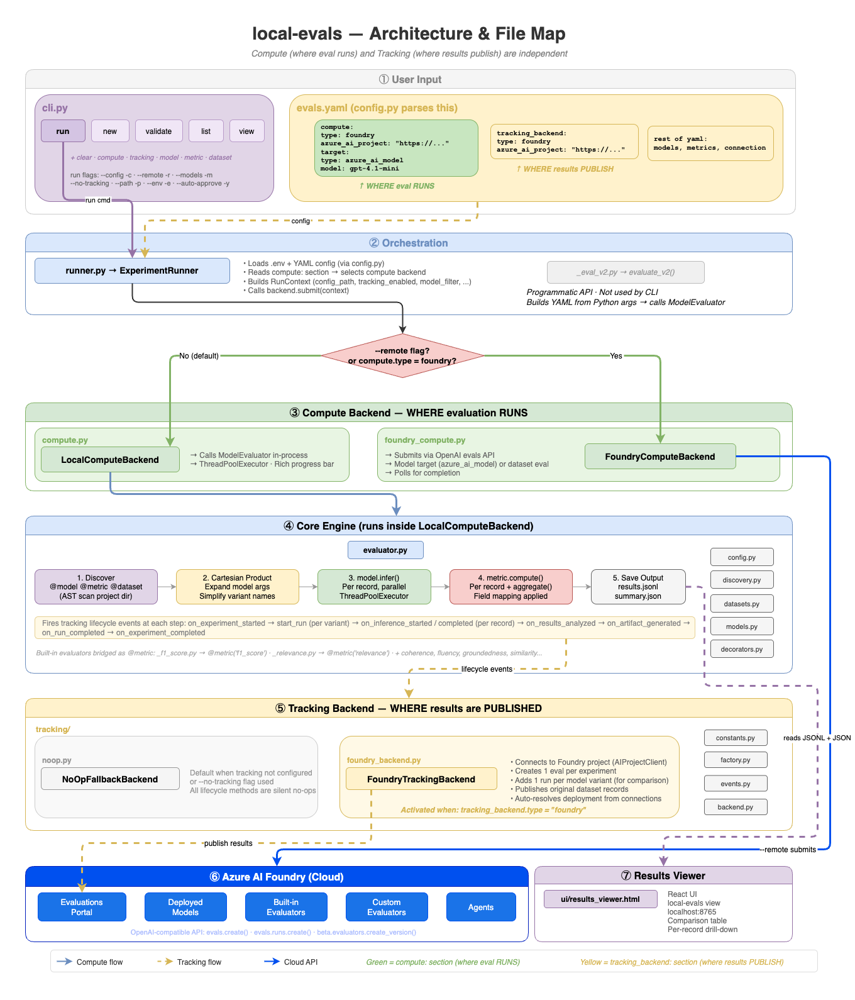

# ev-demo

All-in-one demo project for local-evals — showcases every evaluation pattern.

## Architecture



> 📐 Editable source: [local-evals-architecture.drawio](docs/local-evals-architecture.drawio)

local-evals separates **what** to evaluate (config) from **how** to run it (CLI flags):

- **Config** defines: dataset, targets, evaluators, connections
- **CLI flags** control: `--remote` (Foundry cloud)

```bash
# Same config, different modes:
ev run -c config.yaml                    # Run locally
ev run -c config.yaml --remote           # Run on Foundry cloud
```

---

## Quick Start

1. **Configure credentials**

   ```bash
   cp .env.sample .env
   # Edit .env with your Azure OpenAI / Foundry credentials
   # Then run: az login
   ```

2. **Install dependencies**

   ```bash
   uv sync
   ```

3. **Run a demo**

   ```bash
   ev run                                              # Default: custom evaluators (no Azure needed)
   ev run -c configs/evals_mixed.yaml                  # F1 + relevance (Azure)
   ev run -c configs/evals_model_comparison.yaml       # 2 models × 2 temps
   ev run -c configs/evals_agent_full.yaml             # MAF agent + 10 evaluators
   ev run -c configs/evals_multi_framework.yaml        # MAF vs OpenAI vs LangChain
   ev run -c configs/remote_agent_eval.yaml --remote   # Remote Foundry agent
   ```

---

## Demos

### 1. Custom Evaluator (default — no Azure needed)

Create your own `@evaluator` class — auto-discovered from the working directory.

```bash
ev run
```

**Config:** [`config.yaml`](config.yaml) — `f1_score` + custom `answer_length` + `conciseness` from [`evaluators/`](evaluators/).

---

### 2. Dataset Evaluation — NLP + LLM-as-judge

Score pre-computed responses with built-in metrics. No targets needed.

```bash
# Local (F1 is local, relevance calls Azure OpenAI)
ev run -c configs/evals_mixed.yaml

# Same config, run entirely on Foundry cloud
ev run -c configs/evals_mixed.yaml --remote
```

**Config:** [`configs/evals_mixed.yaml`](configs/evals_mixed.yaml) — `f1_score` (NLP) + `relevance` (LLM-as-judge) on a QA dataset.

---

### 3. Model Comparison — Cartesian Product

Compare **multiple models × multiple parameters** in one experiment.

```bash
# Run locally
ev run -c configs/evals_model_comparison.yaml

# Run on Foundry cloud (side-by-side comparison in portal)
ev run -c configs/evals_model_comparison.yaml --remote
```

**Config:** [`configs/evals_model_comparison.yaml`](configs/evals_model_comparison.yaml) — 2 models × 2 temperatures = 4 evaluations with `relevance` + `coherence`.

---

### 4. Agent Evaluation — Tools + OTel Tracing

Evaluate an AI agent with **tool calls**. Targets just return `{"answer": text}` — the engine auto-captures tool calls, messages, and token usage via OTel tracing.

```bash
# Full agent eval (coherence, task adherence, tool call accuracy)
ev run -c configs/evals_agent_full.yaml
```

**Config:** [`configs/evals_agent_full.yaml`](configs/evals_agent_full.yaml) — MAF weather agent with `coherence`, `response_completeness`, `task_adherence`, `intent_resolution`, `tool_call_accuracy`.

**Target:** [`targets/weather_agent_local_maf.py`](targets/weather_agent_local_maf.py) — the `infer()` method is just:
```python
def infer(self, input):
    result = await self._agent.run(query)
    return {"answer": result.text}  # Engine auto-enriches from OTel traces
```

---

### 5. Multi-Framework Agent Comparison

Same weather agent, 3 frameworks, side-by-side:

```bash
ev run -c configs/evals_multi_framework.yaml
```

**Config:** [`configs/evals_multi_framework.yaml`](configs/evals_multi_framework.yaml)

| Framework | Target | `infer()` returns |
|-----------|--------|-------------------|
| **MAF** | [`targets/weather_agent_local_maf.py`](targets/weather_agent_local_maf.py) | `{"answer": result.text}` |
| **OpenAI SDK** | [`targets/openai_agent_target.py`](targets/openai_agent_target.py) | `{"answer": response.output_text}` |
| **LangChain** | [`targets/langchain_agent_target.py`](targets/langchain_agent_target.py) | `{"answer": response.content}` |

All return just the answer — the engine auto-enriches with `output_items`, `tool_calls`, `tool_definitions` from OTel traces.

---

### 6. Remote Agent Evaluation — `azure_ai_agent` Target

Evaluate an agent **published in Azure AI Foundry** without writing any target code.
The `azure_ai_agent` target type invokes the agent via the Responses API — Foundry handles tool execution server-side.

```bash
# Run on Foundry cloud — agent runs remotely, evaluators run remotely
ev run -c configs/remote_agent_eval.yaml --remote
```

**Config:** [`configs/remote_agent_eval.yaml`](configs/remote_agent_eval.yaml) — a documentation assistant connected to a [Context7](https://context7.com) MCP server, evaluated with `coherence`, `relevance`, `task_adherence`, `intent_resolution`.

```yaml
compute:
  type: "foundry"
  azure_ai_project: "${AZURE_AI_PROJECT}"

targets:
  - name: "context7-docs-agent"
    type: "azure_ai_agent"        # No target code needed
    agent_name: "context7-docs-agent"
```

With `--remote`, the agent name is all that's needed — Foundry resolves the agent within the project specified in `compute.azure_ai_project`. For local execution, the agent target resolves the project endpoint from `connection_name` → `connections` (same pattern as other targets).

The agent must be published in the Foundry project (visible in the portal under **Agents**).

---

## Quick Reference

### CLI

```bash
ev run -c <config>                        # Run locally
ev run -c <config> --remote               # Run on Foundry cloud
ev discover                               # List built-in evaluators
ev new <name>                             # Scaffold new project
```

### Config Structure

Configs describe **what** to evaluate — never how to run it:

```yaml
experiment:
  name: "my-eval"
  dataset:                    # Input data
    type: "jsonl"
    args: { data_path: "data.jsonl" }
  targets:                    # What to evaluate (optional)
    - name: "my_agent"
      type: "custom"          # or "azure_ai_model" or "azure_ai_agent"
      connection_name: "default"
  evaluators:                 # Which metrics to compute
    - name: "relevance"
      mapping:
        query: "dataset.question"
        response: "model.answer"
  connections:                # Shared connections for targets + LLM-as-judge evaluators
    default:
      azure_endpoint: "${AZURE_OPENAI_ENDPOINT}"
      azure_deployment: "${AZURE_OPENAI_DEPLOYMENT}"
      azure_ai_project: "${AZURE_AI_PROJECT}"   # Required for azure_ai_agent targets
```

### Capabilities

| Feature | Local | Remote (Foundry) |
|---------|-------|-------------------|
| Built-in metrics | ✅ | ✅ |
| Custom `@evaluator` | ✅ Full Python | ⚠️ Sandbox |
| Custom `@target` | ✅ | ❌ Use `azure_ai_model` or `azure_ai_agent` |
| `azure_ai_agent` target | ✅ | ✅ |
| OTel trace capture | ✅ Auto-enabled | N/A |
| Cartesian product | ✅ | ✅ |

### Project Structure

```
ev-demo/
├── config.yaml                            # Default config (custom evaluators, no Azure)
├── configs/                               # Additional demo configs
│   ├── evals_mixed.yaml                   # Dataset: F1 + relevance
│   ├── evals_custom_evaluator.yaml        # Dataset: custom evaluators
│   ├── evals_model_comparison.yaml        # Models: 2 models × 2 temps
│   ├── evals_agent_full.yaml              # Agent: MAF + tools + tracing
│   ├── evals_multi_framework.yaml         # Agent: MAF vs OpenAI vs LangChain
│   └── remote_agent_eval.yaml             # Remote: azure_ai_agent
├── data/                                  # Datasets
│   ├── qa_data.jsonl                      # QA dataset (demos 1-3)
│   ├── agent_eval_data.jsonl              # Agent queries (demos 4-5)
│   └── context7_eval_data.jsonl           # Doc queries (demo 6)
├── targets/                               # Agent @target implementations
│   ├── weather_agent_local_maf.py         # MAF agent
│   ├── openai_agent_target.py             # OpenAI SDK agent
│   └── langchain_agent_target.py          # LangChain agent
├── evaluators/                            # Custom @evaluator implementations
│   ├── word_count.py                      # Word count (scaffold example)
│   ├── answer_length_evaluator.py         # Answer length scoring
│   ├── conciseness_evaluator.py           # Conciseness scoring
│   └── response_completeness_evaluator.py # Response completeness
├── docs/                                  # Diagrams
├── pyproject.toml                         # Dependencies
└── .env                                   # Credentials (not committed)
```
